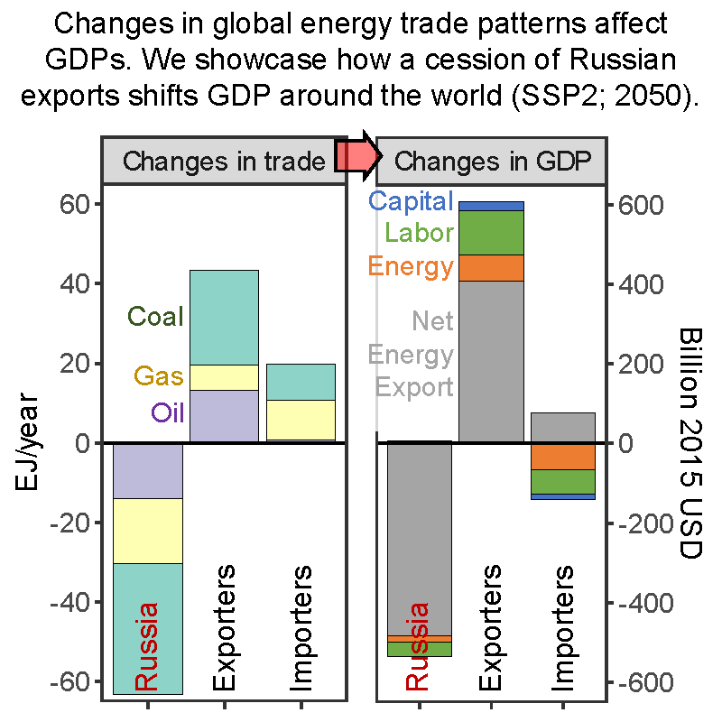

# Overview

This repository includes an R project (R codes, functions, and data) for generating key figures in the paper:

**Sensitivity of Future Regional and Global Energy Markets and Macroeconomic Activity to a Hypothetical International Energy Market Disruption**  

James Edmonds*, Xin Zhao, Pralit Patel, Di Sheng, Ellie Lochner, Christoph Bertram, Gokul Iyer, Michael Westphal, Allen Fawcett, Stephanie Waldhoff

Joint Global Change Research Institute, Pacific Northwest National Laboratory  
*Corresponding Author.

